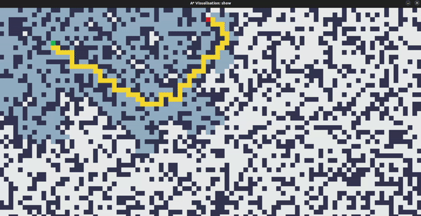

## A* Algorithm Visualization

Visualization for the search alogrithm A*, coded in python.  
A* algorithm is a pathfinding algorithm used to find the shortest path between two points in a graph or grid. It intelligently combines both the breadth-first search and the heuristic evaluation to efficiently explore the most promising paths first, making it ideal for navigation and route planning applications.

### Installation

1. Install pacakge pygame: ```pip install pygame```
2. Run main: ```python3 main.py```

### Usage
- Drag start / end to change it's position.
- `F` to show grid and current view values.
- `Space` or `Return` to switch between view modes.
- `R` to reset the board
- `D` to shuffle the board and create a random pattern.
- `W` to show the search in action.

### Screenshots

