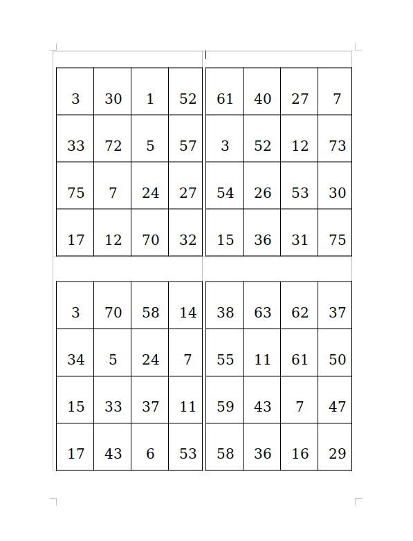

## Manipulated Bingo Game

Date: 2020.

A bingo word-document generator. The bingo boards generated using this program all share one pre-determined number, so everyone can win at the same time.  
I remember that I created this program after I heard my father told me that Lior Suchard did a 'magic' like this to them at work, and I wanted to recreate this.  

### Installation

1. Install pacakge numpy: ```pip install numpy```
2. Run the server: ```python3 server.py```
3. Run the client: ```python3 main.py```

### Usage
1. edit `bingo.py` and change the following variables, to control the output:
    ```
        number_range = 75
        board_size = 4
        magic_number = 7

        boards_amount = 2
        pages = 1
    ```
2. run ```python3 bingo.py```
3. view the output file `bingo.docx`

### Screenshots
The number 7 exists in all the tables, so that everyone will win at the same time!
