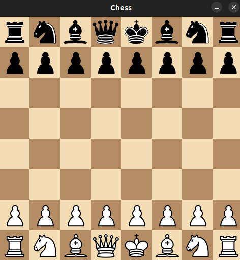

## Chess Game with GUI

Date: 2021.  
A simple application for the game of chess, usign pygame and python.  
This program was created during my High School's CS class, when I was bored.  
Most of the features are implemented, except for *castling* (which is pretty important) and *en passant* (which is less important but way cooler).

### Installation

1. Install pacakge pygame: ```pip install numpy```
2. Run the server: ```python3 main.py```

### Usage
* Each player moves piece at their turn, clicks the piece and the desired place for it to go
* When a player is checkmated the program need to be restarted
* The moves are also ~~poorly~~ printed to the screen

### Screenshots



