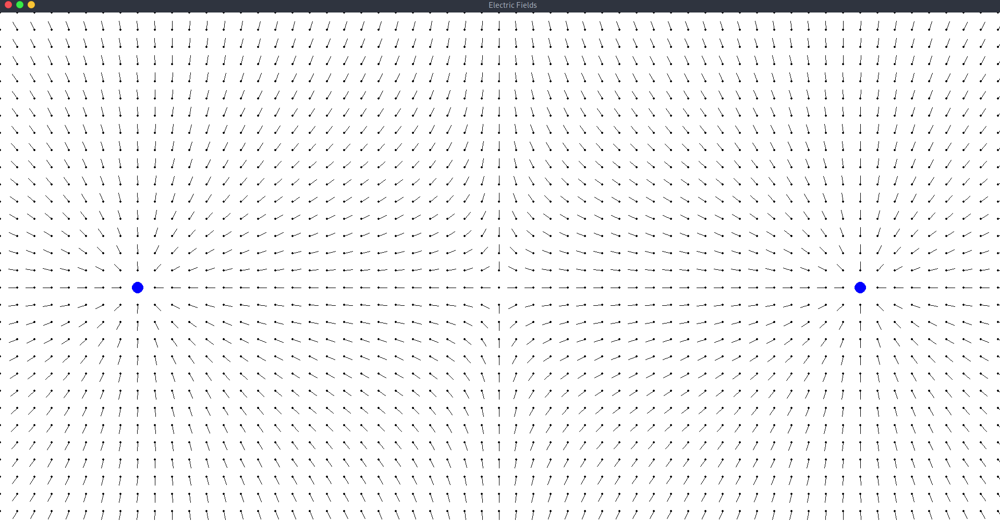

## Electric Fields Simulation

Date: 2022.  
A small simulation for 2d electric fields created using python, with pygame as a graphics lirary.  
The simulation simulates single objects charged with 1[C] each (or -1[C]), and the distance between each dot is 1[m]. All of the math is calculated in pure python using the standard math library.  

The simulation is not perfect, and there are many things to improve upon:
1. Faster computing, by enhancing the algorithm and/or by using an outside library, such as NumPy.
2. Better and/or faster graphics.
3. A bigger, more wholesome simulation: 3D. Could be implemented by using Gauss law...
4. And etc. This has the potential to become a whole eletric physics simulation. Very nice!


## Installation
1. Install package pygame: ```pip install pygame```
2. Run the main program: ```python3 fields.py``` 

## Usage
- `left click` for a positive charged object.
- `right click` for a negatvie charged object.
- `scroll wheel` to zoom in (earses all objects).
- `R` to reset.
* The screen size is adjustable.

## Screenshots

