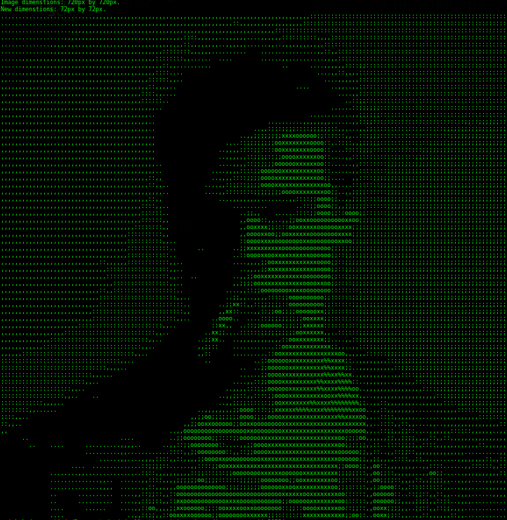

## Image to ASCII

A tool to convert images to ascii characters that look like the image, coded in c. This program uses stb_image to load the images and manipulate them.

### Installation & Usage
 *This project was coded in a linux based system*

1. Build the program: ```make```
2. Add images to /images
3. run the program with the image you want and new scale. Without the scale the default scale will be used: ```./bin <filename> <scale>```
4. Lower the font size and switch to monospace font. Also you can zoop out in the terminal.

## Screenshots
Example image of Tyler Durden from the movie Fight Club turned into ascii (original in /images):  
