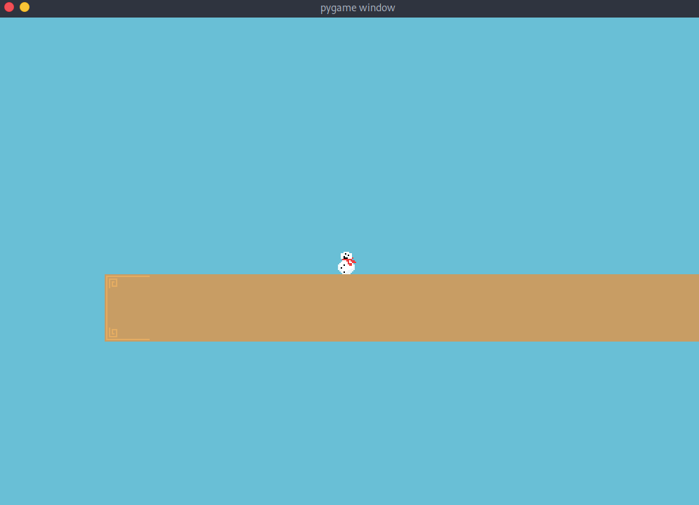

# Platformer Game

A simple baseline for a platformer game.  
This program uses pygame as a graphics library, and pytmx as a map loader library. Also this project uses other simple python libraries.  
The idea for this specific game is crouch attacking ability, which will be the focus of the game. Sadly I never finished this as a game, so as for now this is a discontinued project. I am pretty sure this was made in a few days in Jan 2021 (maybe when I had COVID-19).  

## Installation
1. Install package pygame and pytmx: ```pip install pygame pytmx```
2. Run main: ```python3 main.py```

## Usage
- `WASD` for movement.
- `S` activates crouch, sliding ability.

## Screenshots
