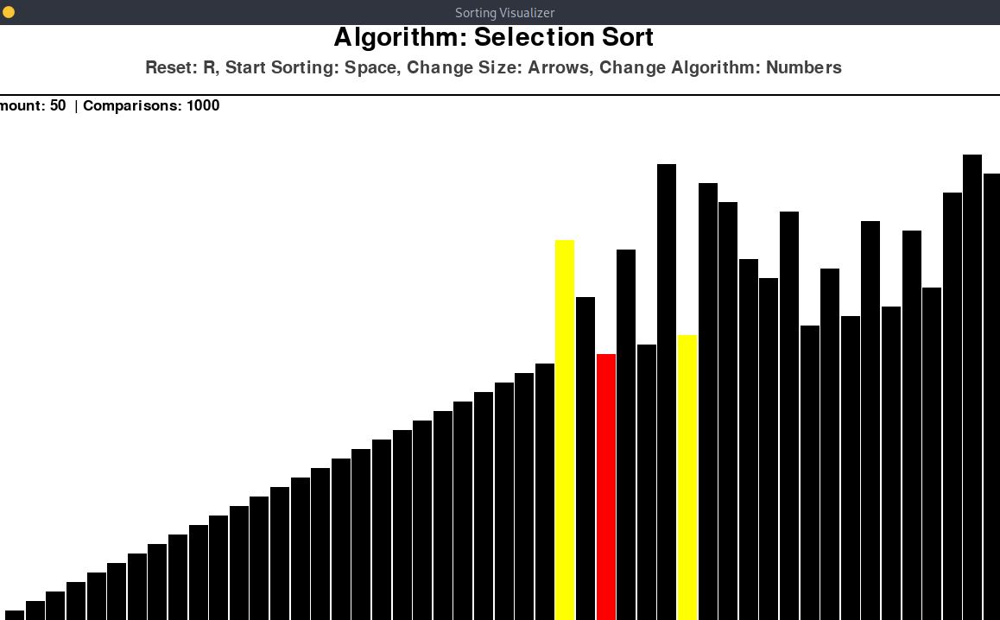

## Sorting Algorithms Visualizer

A visualization for various different sorting algorithms.  
This program uses pygame as a graphics library. All of the alogirthms are implemented using pure python.  
Date: 2022-2021.  

## Installation
1. Install package pygame: ```pip install pygame```
2. Run the app: ```python3 main.py```

## Usage
How to use:
- `Space` to start sorting.
- `R` to reset.
- `Arrow Up` and `Arrow Down` to changet the array size.
- `1-5` to change the alogrithm.

## Screenshots
