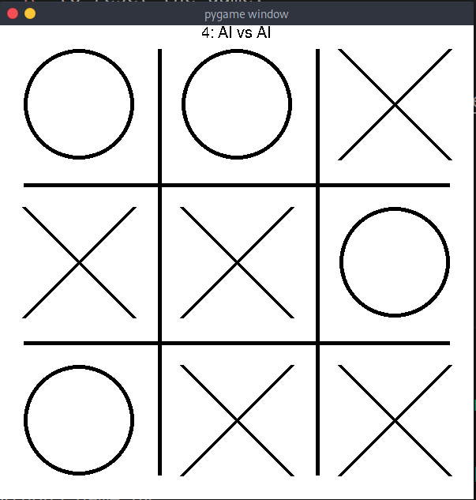

## Tic-Tac-Toe with Minimax

A Tic Tac Toe game implemented in Python using Pygame. The game also has built in algorithm to play the best move, implemented using Minimax.
This was created during my CS class during high school, when I was bored. The first version was in java using the terminal to display the board.  
Date: late 2020, early 2021


## Installation
1. Install package pygame: ```pip install pygame```
2. Run main: ```python3 game.py```

## Usage
- `1-4` to switch game modes.
- `R` to reset the game.
- `mouse click` to place the `X` and `O`.

## Screenshots
