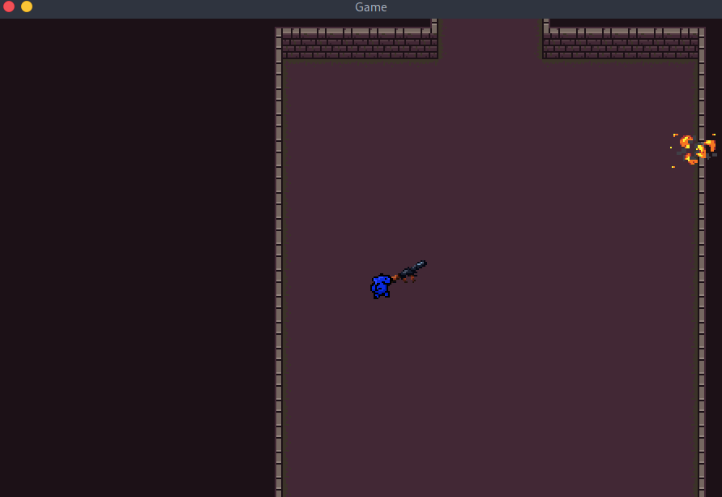

## Top Down Shooter Game

A simple baseline for a top down shooter game.  
This program uses pygame as a graphics library, and pytmx as a map loader library. Also this project uses other simple python libraries.    
This is a discontinued project. I am pretty sure this was made in a few days when I had COVID-19, and I was forced to stay in my room.  
I made a lot of top down shooters in Unity and Java, during 8th and 9th grade, this one was a small gesture to them I made becasue I was bored and stuck in my room...
In the images folder there are many "trash" object and\or maps. I had those laying around when I played with the map creation.  
Date: Jan 2021.


## Installation
1. Install packages pygame, numpy and pytmx: ```pip install pygame numpy pytmx```
2. Change directory to /code: ```cd code```
3. Run the main file: ```python3 main.py```

## Usage
- `WASD` for movement.
- `Space` for dash.
- `Q` for dropping and picking up guns.
- `Left` mouse button for shooting.

## Screenshots
  
